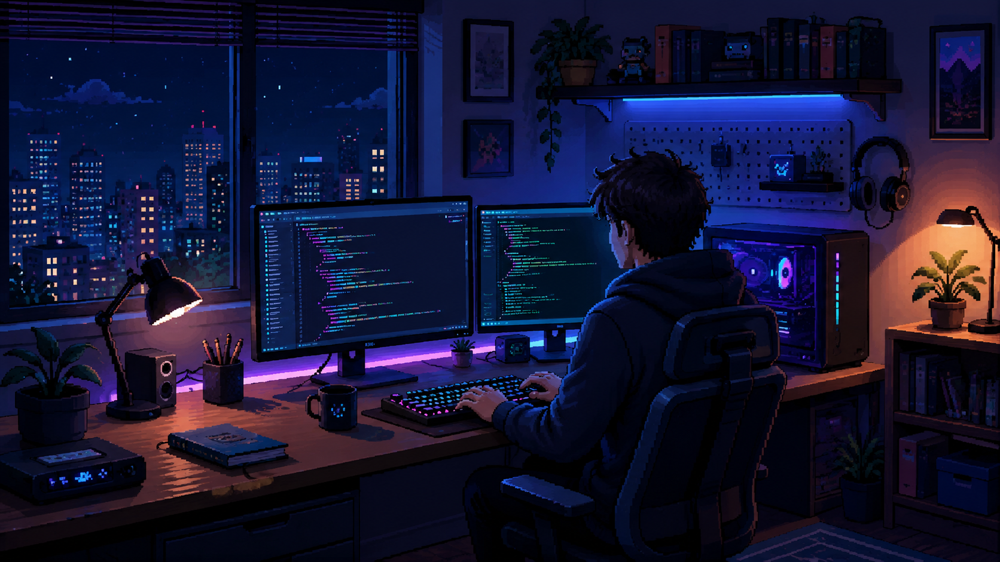

---

## 🔭 Atualmente estou estudando

  
  
  
  
  
  
  
  

---

## 💬 Sobre mim...

Sou Kennedy, tenho 27 anos e sou natural de Brasília - DF, Brasil.  
Atualmente estudo **Análise e Desenvolvimento de Sistemas** e estou construindo minha trajetória na área de tecnologia.

Tenho interesse em desenvolvimento web, especialmente frontend, e estou sempre buscando evoluir através de estudos, prática e novos projetos.  
Gosto de aprender novas ferramentas, resolver problemas e transformar ideias em soluções funcionais.

- 🔭 Atualmente, estou focado no desenvolvimento frontend e explorando projetos full-stack.
- 💻 Estudante de Análise e Desenvolvimento de Sistemas.
- 🚀 Buscando evoluir constantemente na área de tecnologia.
- 🌎 Natural de Brasília - DF, Brasil.
- 🎂 Tenho 27 anos.

---

## 📫 Como entrar em contato comigo:

---

  

